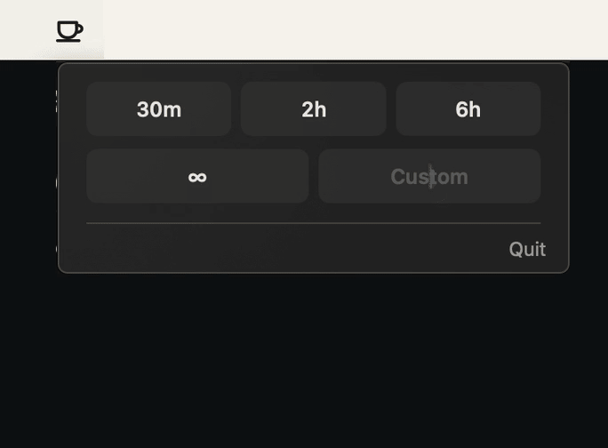

# Don't Die On Me Now

> [!WARNING]
> Preventing sleep can make a MacBook run hot. Keep it on a hard, well-ventilated surface, never inside a bag or sleeve, and use it at your own risk.

A small macOS menu bar utility for keeping Codex and Claude Code running while a MacBook lid is closed.

Choose 30 minutes, 2 hours, 6 hours, a custom duration, or an infinite session. Timed sessions restore normal sleep automatically.



## Install With Codex Or Claude Code

Copy and paste this message into Codex or Claude Code on the Mac where you want the app installed:

```text
Install Don't Die On Me Now from:
https://github.com/ILikeAI/dont-die-on-me-now

Clone the repository. Run the default installer to build and install the app. Then start the installed app and verify it is running in the menu bar. Do not start an awake session. Pass on the repository's heat warning. Once it is running, ask whether it should open automatically at login and apply my answer.
```

## Install Manually

This requires the Xcode command-line tools.

```sh
git clone https://github.com/ILikeAI/dont-die-on-me-now.git
cd dont-die-on-me-now
./install.sh
```

The installer puts the app in `~/Applications` and installs a narrow privileged helper. macOS shows one standard administrator dialog during setup. After that, starting and stopping awake mode should not require another password.

The installer also installs a small OpenCode plugin at `~/.config/opencode/plugins/dont-die-on-me-now.js`. Use `--no-opencode` to skip that integration.

The app opens in the menu bar and can be found through Spotlight as "Don't Die On Me Now". Launch at login opens the utility but does not start an awake session.

Useful install options:

```sh
./install.sh --at-login      # Open the utility automatically at login
./install.sh --no-at-login   # Disable automatic launch at login
./install.sh --no-helper     # Prompt for administrator approval on every sleep change
./install.sh --opencode      # Install the OpenCode completion integration
./install.sh --no-opencode   # Skip the OpenCode completion integration
./install.sh --system        # Install the app in /Applications
```

The helper supports one macOS user account per Mac. This is normally irrelevant on a developer laptop, but the installer refuses to silently replace a helper configured for another user.

The app is built locally from source and ad-hoc signed. It is not a Mac App Store app.

See [Features And Requirements](docs/FEATURES.md) for the complete feature behavior, OpenCode requirements, privacy boundaries, permissions, and troubleshooting guide.

## Use

1. Click the coffee cup in the menu bar.
2. Choose `30m`, `2h`, `6h`, or the infinite button.
3. For a custom duration, type the number of minutes and click Start.
4. Click Stop to restore normal sleep early.
5. In `Shutdown Mac`, choose `30m`, `2h`, `6h`, or enter custom minutes to power off the Mac automatically. Enable `Quiet shutdown` to suppress macOS warning messages. Click `Cancel` before the deadline to cancel it.
6. To start the shutdown delay only after OpenCode finishes, enable `Start countdown after OpenCode finishes`, choose `First task only` or `All active tasks`, choose the delay, then run the next OpenCode task. A failed task also triggers the delay; a task explicitly canceled by the user does not.

Ready mode shows a quiet coffee cup. Timed and infinite sessions show a steaming cup. Timed sessions also show an hour- or minute-level countdown in the menu bar and a live countdown to the second in the menu.

## Permissions

Changing `pmset -a disablesleep` requires administrator permission on macOS. The installer handles that once by placing a root-owned helper at:

```text
/Library/Application Support/DontDieOnMeNow/privileged_helper.sh
```

The helper does not accept arbitrary shell commands. It accepts only start, stop, schedule-shutdown, or cancel-shutdown actions, validates session tokens, file paths, and durations, and limits timed sessions and shutdowns to 24 hours. It does not receive or store your password.

The helper starts on demand when the app sends a request, so it does not poll in the background. Timed sessions use a separate root restore job that launchd restarts if it exits unexpectedly.

If the helper is unavailable, the app falls back to the standard macOS administrator prompt instead of silently failing.

## Safety

Do not use this with a MacBook inside a bag or sleeve. Keep it on a hard, ventilated surface, ideally connected to power.

Timed sessions do not depend on the menu bar app staying open. Their root restore job remains loaded until it restores normal sleep, and launchd restarts that job after an abnormal exit.

Scheduled shutdowns also continue if the menu bar app is closed. The app saves the deadline so the countdown returns when it is reopened. Cancel a scheduled shutdown from the menu before it runs.

The OpenCode integration arms a one-shot marker for the next OpenCode session. `First task only` watches the first session that becomes busy. `All active tasks` watches every session that becomes busy while armed and waits for all of them to finish. OpenCode reports completion through its `session.idle` event, and the plugin sends a local notification URL containing the session IDs back to this app. Restart OpenCode after installing or updating the plugin so it reloads the integration.

Infinite mode is intentionally different. It stays active until Stop is clicked or normal sleep is restored manually. If the app is force-quit during an infinite session, reopen it and click Stop, or run:

```sh
./script/restore_sleep_now.sh
```

## Update

From the source clone, update with:

```sh
git pull
./install.sh
```

The installer skips an already-current helper, so ordinary app updates do not ask for the administrator password again. A helper update may require one new approval.

## Uninstall

```sh
./uninstall.sh
```

Uninstall first restores normal sleep, then removes the helper, login launcher, app, and saved settings. It asks for administrator approval because removing the root helper safely requires it.

If the original installer folder is gone, the installed app keeps a copy of the uninstaller:

```sh
"$HOME/Applications/Don't Die On Me Now.app/Contents/Resources/uninstall.sh"
```

Keep saved settings with:

```sh
./uninstall.sh --keep-settings
```

## Developer Commands

Run these from a source clone:

```sh
swift test                         # Run the test suite
./script/build_and_run.sh          # Build and launch from the repo
./script/safety_status.sh          # Inspect sleep, helper, and launchd state
```

Lid-closed timer test:

```sh
./script/lid_closed_smoke_test.sh --minutes 15 --expect-sleep-after-minutes 10
```

The smoke-test script only logs a heartbeat. It does not keep the Mac awake itself.

## Compatibility

Requires macOS 13 or newer and a Mac that supports:

```sh
pmset -a disablesleep
```

The app verifies the `pmset` result after every change. It has been tested on macOS 14.6. Other macOS versions have not been personally tested.

On macOS 26.x, `pmset -g` may omit `SleepDisabled` while normal sleep is enabled. The app falls back to `pmset -g assertions` to recognize that normal state and fails closed when the result is ambiguous.

## Privacy

- No telemetry.
- No network access.
- No password storage.

## License

MIT. See [LICENSE](LICENSE).
